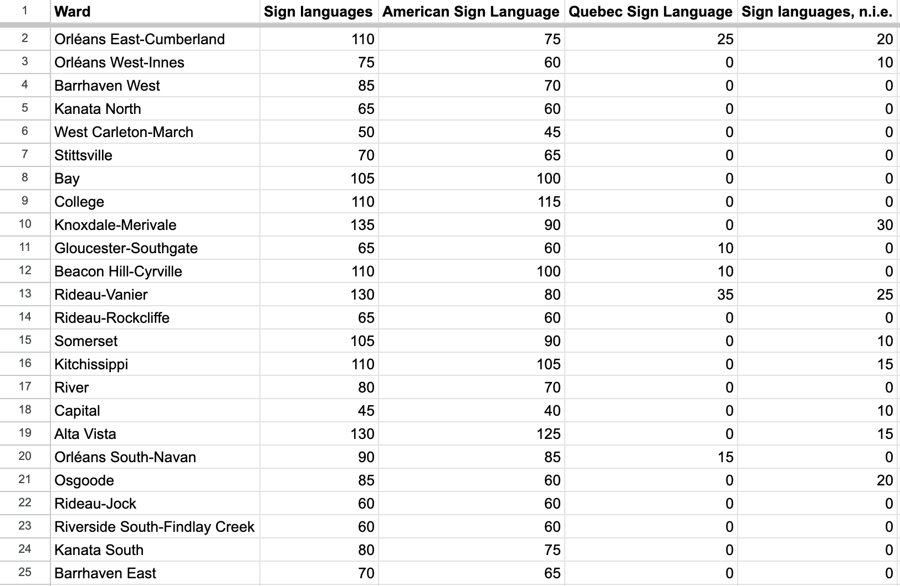
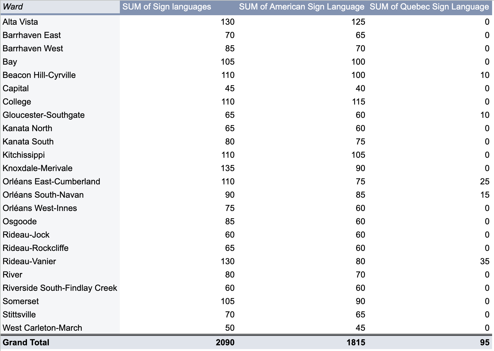
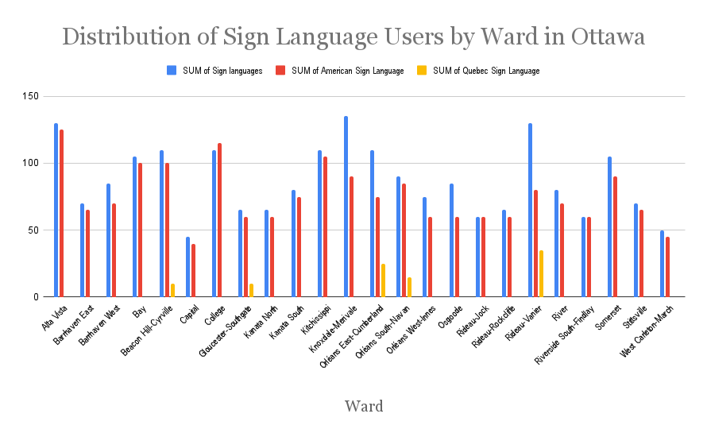

**November 5, 2025**<br>
**MPAD2003 & Introductory Data Storytelling**<br>
**Erica Lee, Alex Overton, Angus Mclean**<br>
**Presented to Jean-Sébastien Marier**<br>

# Exploratory Data Analysis (EDA) & Pitch

<!-- Use one hashtag symbol (`#`) to create a level 1 heading like this one.

## Foreword

For this assignment, you must extract data from a dataset provided by the instructor. You must then clean and analyze the data, create exploratory charts/visualizations, and find a potential story idea. Your assignment must clearly detail your process. You are expected to write about 1500-2000 words, and to include several screen captures showing the different steps you went through. Your assignment must be written with the Markdown format and submitted on GitHub Classroom.

I have been assigning different versions of this project to my digital journalism and data storytelling students for a few years now. Its structure was inspired by the main sections/chapters of [*The Data Journalism Handbook*](https://datajournalism.com/read/handbook/one/). This version was further inspired by the [Key Capabilities in Data Science](https://extendedlearning.ubc.ca/programs/key-capabilities-data-science) program offered by the University of British Columbia (UBC).

**Here are some useful resources for this assignment:**

* [GitHub's *Basic writing and formatting syntax* page](https://docs.github.com/en/get-started/writing-on-github/getting-started-with-writing-and-formatting-on-github/basic-writing-and-formatting-syntax)
* [The template repository for this assignment in case you delete something by mistake](https://github.com/jsmarier/jou4100_jou4500_mpad2003_project2_template)

Did you notice how to create a hyperlink? In Markdown, we put the clickable text between square brackets and the actual URL between parentheses.

And to create an unordered list, we simply put a star (`*`) before each item. -->

## Introduction
For this assignment, my team and I will clean and analyze Statistics Canada’s Long Form Census, specifically the Ward Data for the city of Ottawa, ON, from 2021. We will create visualizations and charts to help clearly communicate a narrative whose origins were found within the data.  

This data was collected as a sample, surveying only 25% of households in Ottawa. The data, available at https://open.ottawa.ca/datasets/ottawa::2021-long-form-census-ward-data/explore, was most recently updated on October 19th, 2025 and was first published on November 29th, 2023. The data provides insight into the lives of Ottawans through many aspects of their lives, including the language(s) spoken at home.

Our process will be broken up into the following sections:
- **Getting Data**
- **Understanding Data**
- **Our Potential Story**
- **Conclusion**


## Getting Data

 Use two hashtag symbols (`##`) to create a level 2 heading like this one.

To include a screen capture, use the sample code below. Your images should be saved in the same folder as your `.md` file.

<br>
*Figure 1: The "Import file" prompt on Google Sheets.*

**Here are examples of functions and lines of code put in grey boxes:**

1. If you name a function, put it between "angled" quotation marks like this: `IMPORTHTML`.
1. If you want to include the entire line of code, do the same thing, albeit with your entire code: `=IMPORTHTML("https://en.wikipedia.org/wiki/China"; "table", 5)`.
1. Alternatively, you can put your code in an independent box using the template below:

``` r
=IMPORTHTML("https://en.wikipedia.org/wiki/China"; "table", 5)
```
This also shows how to create an ordered list. Simply put `1.` before each item.

## Understanding Data

### VIMO Analysis

Use three hashtag symbols (`###`) to create a level 3 heading like this one. Please follow this template when it comes to level 1 and level 2 headings. However, you can use level 3 headings as you see fit.

Insert text here.

Support your claims by citing relevant sources. Please follow [APA guidelines for in-text citations](https://apastyle.apa.org/style-grammar-guidelines/citations).

**For example:**

As Cairo (2016) argues, a data visualization should be truthful...

### Cleaning Data

Before beginning our analysis, the dataset needed to be cleaned in order to make the data more consistent and easier to follow. There were several unnecessary rows, some extra whitespace, and lengthy text entries that needed to be adjusted and reorganized. I used Google Sheets to address these issues and followed the cleaning methods we learned during this course.

I began by reviewing the dataset and removing irrelevant data to focus only on the information related to sign language. To do this, I used the find tool (command + F) to search for every row that mentioned sign language and deleted all other entries. This reduced the dataset to only the relevant data, which made it much easier to analyze.

After deleting all unnecessary rows and columns, I used Google Sheets’ Data Clean Up Suggestions to remove extra whitespace from cells. This automatically applied the TRIM function to the relevant cells, ensuring that there were no trailing spaces that could cause issues in later analysis.

Next, I decided to transpose the data to make it easier to interpret. Originally, the dataset had wards listed across columns and sign languages listed across rows. To switch their positions, I used the TRANSPOSE function (=TRANSPOSE(A1:Y5)), which swaps rows and columns.

The names in the dataset were long, including the suffix “ - Ward”. To simplify them, I used the SPLIT function (=SPLIT(A2; “ - Ward”) to separate the text into two columns and then deleted the extra portion, leaving only the ward name.

Lastly, I froze the top row using View → Freeze → 1 Row so that the headers remained visible while scrolling through the dataset. While this step didn’t change much about the dataset, it improved readability and navigation during analysis.

Here is what the dataset looked like after being cleaned:

<br>

### Exploratory Data Analysis (EDA)

I made a pivot table that shows the sum of all signers across each ward in Ottawa, along with the specific sum of just the ASL and QSL signers, in order to see which wards have the highest number of total signers, as well as compare the number of ASL and QSL signers there are in each ward. If certain wards stand out, that might suggest that the deaf community participation could indeed influence residential clustering.

<br>
*Figure 2: This pivot table shows the sum of all signers across each ward in Ottawa*

After taking the pivot table and turning it into a column chart, it’s fairly easy to see how signers are distributed across wards in the city of Ottawa. The chart shows that signers are spread throughout the city, with totals ranging from 45 to 135 people per ward. The highest numbers appear in Alta-Vista, Knoxdale-Merivale, and Rideau-Vanier, while the lowest are in Capital and West Carleton-March. The data also shows that Ottawa is mainly ASL-dominant, with only 5 wards reporting QSL signers and many wards having small populations of users of other Sign Languages. 
 

<br>
*Figure 3: This exploratory chart shows how signers are distributed throughout Ottawa*

Through this analysis, I learned that signing populations are not evenly distributed across Ottawa and that language type (ASL vs. QSL vs. Indigenous or other Sign Languages) could potentially play a role in how communities are formed. I also learned that visual tools such as pivot tables and charts make it easier to spot patterns and think critically about what might cause them.

The potential story here is that certain wards might have stronger Deaf or signing communities, possibly because of access to community services, schools or networks that support sign language users. The fact that QSL is only present in 5 wards could suggest that there are localized French Deaf communities, while the overall dominance of ASL points to broader accessibility and use across the city.

For next steps, it would be useful to compare these totals to each ward’s overall population to see if the high counts actually represent larger Deaf communities or just larger ward populations. Calculating signers per capita could reveal stronger concentration patterns. It may also be worth exploring demographic or geographic factors, like proximity to schools for the Deaf or community centers, to understand why certain wards have higher totals.


## Potential Story

The potential story that we could tell with this data is that certain wards might have larger Deaf communities due to access to support structures, such as schools or community networks for the Deaf. In order to “tell” this story, we would likely need other resources such as maps of support centers for the Deaf, testimony from involved individuals, and possibly statistics from sources such as the city website. 

For testimony, we could interview members of the Deaf community who live in districts with a large number of Deaf people in them to see what they find appealing about the area, or conversely, we could interview in smaller communities to see what they feel is lacking. We could also interview people who work at support centers or schools for the Deaf in order to see what they feel they do to make the area attractive. We could also interview Denise DeShaw,  who used to be the head of the Ontario Association for the Deaf (OAD) and is currently the head of the ASL program at Carleton.

Many online resources can help provide more context to the story, such as news articles, studies, or city releases from the area. This additional context and data could help us flesh out, verify and add a personal touch to the story. This allows it to be clearer and more impactful. Some potential sources that could align with these criteria are:

An article about Ottawan Deaf advocacy for sign languages to be recognized as official Canadian languages in Ottawa before it was recognized under the Accessible Canada Act in 2019: https://capitalcurrent.ca/ottawas-deaf-community-calls-for-official-recognition-of-sign-language/
An article about an event recognizing Ottawa’s Deaf community on Parliament Hill during International Week of Deaf People (IWDP): https://charlatan.ca/ottawa-raises-deaf-flag/
An article about opportunities in education for the Deaf in Ottawa: https://www.ocdsb.ca/programs-learning/special-education/special-education-elementary/elementary-special-education/deaf-hh 

## Conclusion

While completing this assignment, one aspect that we found challenging was that the data had a small error in it at the start, and was in need of cleaning. If the error had not been noticed and we had gone ahead with cleaning the data, it could have resulted in it getting lost and messing up the data and results, which would have been unfortunate for our analysis. Thankfully, it was found and rectified before the cleaning process, which also helped clarify the data. By trimming down on blank spaces, uneven rows and columns, and repetitive labelling, we were able to clean the data down to a concise spreadsheet that made it clearer to view the data pertinent to our goals.

An aspect of this assignment that we found rewarding was that once the data was cleared, some clear patterns emerged from the data, especially once it was visualized in charts and tables. This would make it easier to work towards answering our main question, as clear patterns and trends are easier to begin to understand when visualized, as well as aiding in identifying missing information.

One gap in my own knowledge that I have identified is that I do not really have any preexisting knowledge of the Deaf community in Ottawa, and I did not really know where to look first for supplementary materials for this assignment. I feel that I have rectified this somewhat, although I feel there is still a lot to learn. One thing that could have been done differently on this assignment is that we could have committed the project at more regular intervals, although I am unsure if this would have impacted the final result at all or not.

## References

Jean-Sébastien, M. (2021, October 9). Cleaning Data in Google Sheets[Video]. YouTube. https://youtu.be/U4yigiawIEU?si=UkYborn3k3y-Q3qo 

Grieve, N. (2024, May 4). Convert rows to columns in Google Sheets[Video]. YouTube. https://www.youtube.com/watch?v=9kc0PUOuCJw 

Jean-Sébastien, M. (2021, October 19). Using Pivot Tables in Google Sheets[Video]. YouTube. https://youtu.be/cCVl0h-9HmU?si=hLPD51qubB8fzC_x 


